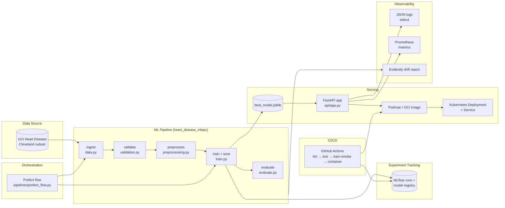
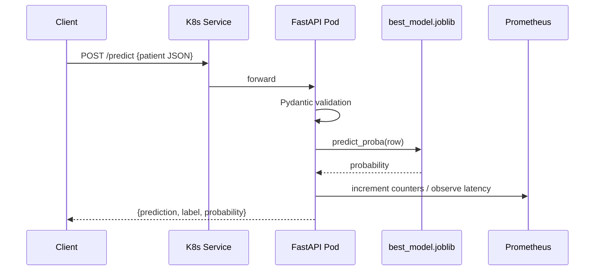

# Architecture

## High-level diagram

## Component summary

| Layer | Component | Path |
|-------|-----------|------|
| Data | UCI Cleveland CSV | `data/heart+disease/processed.cleveland.data` |
| Pipeline | `config`, `data`, `validation`, `preprocessing`, `train`, `evaluate` | `src/heart_disease_mlops/` |
| Notebooks | EDA + training analysis | `notebooks/` |
| Tracking | MLflow file store + model registry | `mlruns/` |
| Orchestration | Prefect 2 flow + weekly schedule | `pipelines/prefect_flow.py` |
| Serving | FastAPI + Pydantic + Prometheus | `api/app.py` |
| Container | Podman/Docker image | `Containerfile` |
| Deployment | Kubernetes manifests | `deploy/k8s/` |
| Monitoring | JSON logs, `/metrics`, Evidently drift | `api/`, `monitoring/` |
| Tests | pytest unit + API + smoke | `tests/` |
| CI | GitHub Actions (lint/test/train/container) | `.github/workflows/ci.yml` |

## Request path

